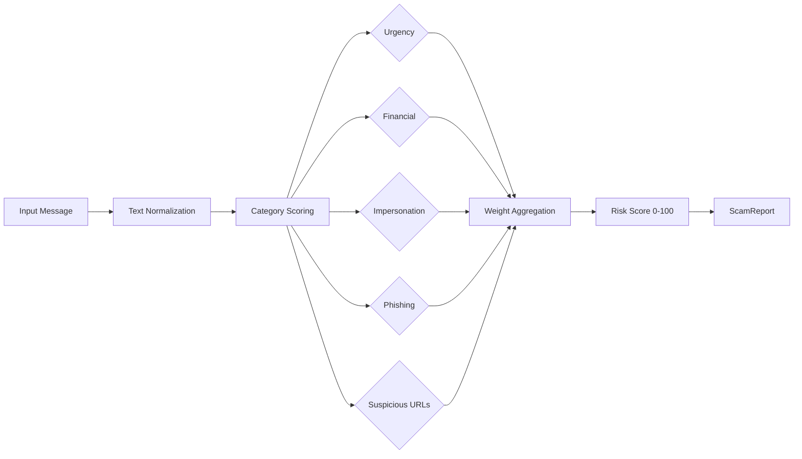

# ScamShield

[](https://github.com/MukundaKatta/ScamShield/actions/workflows/ci.yml)
[](https://www.python.org/downloads/)
[](LICENSE)

**Fraud and scam detection engine** — analyze text messages and emails for phishing, urgency tricks, impersonation, and financial scam patterns.

---

## How It Works



## Quickstart

### Install

```bash
pip install -e .
```

### Python API

```python
from scamshield import ScamDetector

detector = ScamDetector()
report = detector.analyze(
    "URGENT: Your account is suspended. Click here to verify your identity. "
    "Visit http://bit.ly/verify-now"
)

print(report.risk_score.total)    # e.g. 72
print(report.risk_score.level)    # "high"
print(report.flagged_phrases)     # ["click here", "verify your account", "urgent", ...]
print(report.scam_type)           # "phishing"
```

### CLI

```bash
# Analyze a single message
scamshield check "Act now! Send bitcoin to avoid IRS arrest."

# Bulk scan from CSV
scamshield scan messages.csv --column message
```

### Bulk Scanning

```python
from scamshield import BulkScanner

scanner = BulkScanner()
reports = scanner.scan([
    "Hey, lunch tomorrow?",
    "URGENT: Wire $5000 via gift card to avoid arrest!",
    "Your package is on the way.",
])

for r in reports:
    print(f"{r.risk_score.total:3d}  {r.risk_score.level:<8s}  {r.message[:50]}")
```

### Custom Patterns

```python
from scamshield import ScamDetector, DetectionConfig

config = DetectionConfig(
    sensitivity=0.8,
    custom_patterns={
        "romance": ["i love you", "my darling", "send me money"],
    },
    category_weights={
        "urgency": 20.0, "financial": 25.0, "impersonation": 20.0,
        "phishing": 20.0, "suspicious_url": 15.0, "romance": 15.0,
    },
)
detector = ScamDetector(config=config)
report = detector.analyze("My darling, please send me money for a plane ticket")
```

## Detection Categories

| Category | Examples |
|---|---|
| Urgency | "act now", "limited time", "expires today" |
| Financial | "wire transfer", "bitcoin", "gift card" |
| Impersonation | "IRS", "Social Security", "Microsoft Support" |
| Phishing | "verify your account", "click here", "account suspended" |
| Suspicious URLs | Shortened links, suspicious TLDs |

## Development

```bash
pip install -e ".[dev]"
make test
make lint
```

## License

MIT — see [LICENSE](LICENSE).

---

Built by **Officethree Technologies** | Made with ❤️ and AI
